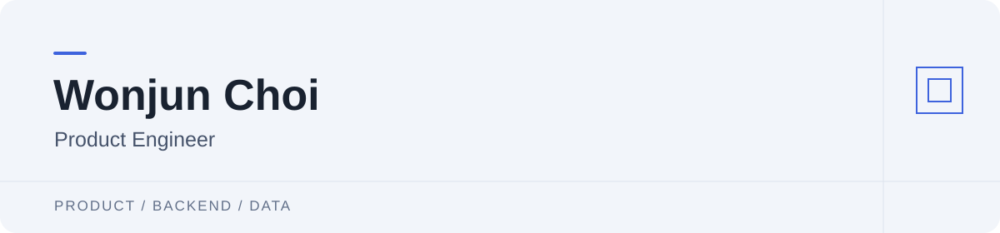

I build backend services and data pipelines, and evaluate AI models for product features. I am currently developing **Seorap**, where I lead product planning, backend development, catalog processing, and model evaluation.

## Selected Projects

### Seorap
**Personal beauty catalog** · Aug 2026 – present

Seorap helps users compare products they own, review ingredients and usage feedback, and organize their routines.

- Improved ingredient-name recall from **0.84 to 0.91** through OCR fine-tuning, evaluated on 105 labeled studio images with separate products for training and evaluation.
- Compared skin-observation models, applied knowledge distillation, and expanded Korean catalog coverage through name normalization and category refinement.

[Case study](https://cwj0666.github.io/seorap.html) · [Live app](https://seorap-beauty.vercel.app/)

### CMS
**Energy data platform** · May – Jun 2026

CMS collects, validates, and aggregates meter events for models and dashboards. The team project uses replayed historical data.

- Designed PostgreSQL schemas to separate raw events, processing policies, aggregate results, and approved observations.
- Built ingestion and **1-minute, 15-minute, and hourly aggregation** pipelines, with Grafana monitoring and ingestion recovery.

[Case study](https://cwj0666.github.io/cms.html)

### Cofathon
**Wellness campaign automation** · Jul 2026

The MVP connects product curation, copy generation, operator review, and publishing.

- Delivered the MVP in **4 hours** using parallel AI-agent development and independent review.
- Defined shared data contracts and task ownership, then verified each stage with type checks, regression tests, and commits.

[Case study](https://cwj0666.github.io/cofathon.html)

## Tech Stack

**Languages & Backend**

  <picture><source media="(prefers-color-scheme: dark)" srcset="assets/python-dark.svg"></picture>&nbsp; Python &nbsp;&nbsp;
  <picture><source media="(prefers-color-scheme: dark)" srcset="assets/sql-dark.svg"></picture>&nbsp; SQL &nbsp;&nbsp;
  <picture><source media="(prefers-color-scheme: dark)" srcset="assets/typescript-dark.svg"></picture>&nbsp; TypeScript &nbsp;&nbsp;
  <picture><source media="(prefers-color-scheme: dark)" srcset="assets/fastapi-dark.svg"></picture>&nbsp; FastAPI &nbsp;&nbsp;

**Data & AI**

  <picture><source media="(prefers-color-scheme: dark)" srcset="assets/postgresql-dark.svg"></picture>&nbsp; PostgreSQL &nbsp;&nbsp;
  <picture><source media="(prefers-color-scheme: dark)" srcset="assets/apachekafka-dark.svg"></picture>&nbsp; Apache Kafka &nbsp;&nbsp;
  <picture><source media="(prefers-color-scheme: dark)" srcset="assets/pytorch-dark.svg"></picture>&nbsp; PyTorch &nbsp;&nbsp;
  <picture><source media="(prefers-color-scheme: dark)" srcset="assets/paddlepaddle-dark.svg"></picture>&nbsp; PaddleOCR &nbsp;&nbsp;
  <picture><source media="(prefers-color-scheme: dark)" srcset="assets/googlecloud-dark.svg"></picture>&nbsp; Google Vision &nbsp;&nbsp;

**Web & Operations**

  <picture><source media="(prefers-color-scheme: dark)" srcset="assets/react-dark.svg"></picture>&nbsp; React &nbsp;&nbsp;
  <picture><source media="(prefers-color-scheme: dark)" srcset="assets/expo-dark.svg"></picture>&nbsp; Expo &nbsp;&nbsp;
  <picture><source media="(prefers-color-scheme: dark)" srcset="assets/docker-dark.svg"></picture>&nbsp; Docker &nbsp;&nbsp;
  <picture><source media="(prefers-color-scheme: dark)" srcset="assets/grafana-dark.svg"></picture>&nbsp; Grafana &nbsp;&nbsp;
  <picture><source media="(prefers-color-scheme: dark)" srcset="assets/githubactions-dark.svg"></picture>&nbsp; GitHub Actions &nbsp;&nbsp;

---

[cwj0666@gmail.com](mailto:cwj0666@gmail.com) · [Portfolio](https://cwj0666.github.io/)

Technology icons: Simple Icons.
